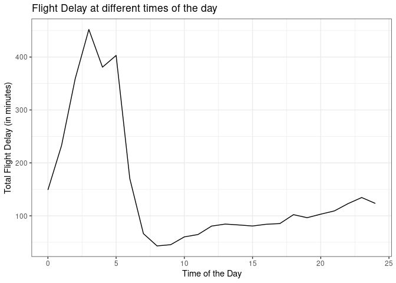
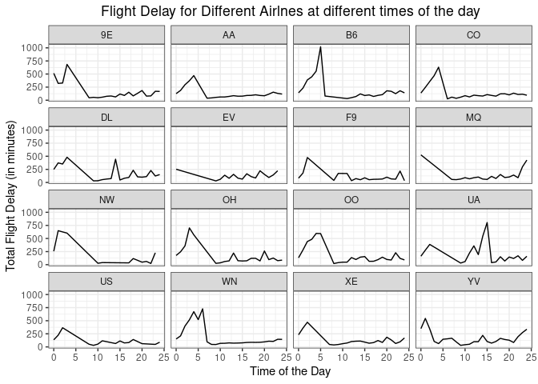
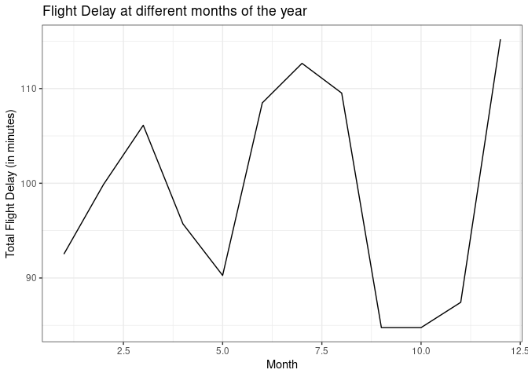
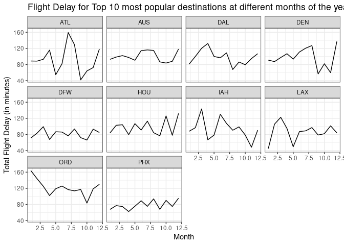

Problem 1 Dataset: ABIA.csv

The below plot shows the flight delay time (for all the airlines
combined) at different hours of the day. The delay time is calculated as
the deviation of arrival time and departure time. Mathematically, it is
written as:- Total Flight Delay = |Arrival Delay|+|Departure Delay|
where |.| represents the absolute value function. Arrival time for all
the flights is rounded off to the hour (hh) of the day. The data is
grouped by the hour (hh) of the arrival time, and the respective mean/
average vale of the Total Flight Delay is calculated for all the hours
of the day.

We can see from the above plot that the total flight delay (for all the
airlines combined) is minimum at around 8 a.m in the morning. This can
be considered as the best time of the day to fly.

Similarly to the above plot, we now plot the total flight delay (in
minutes) v/s time of the day graph for each airline (given by the unique
carrier code).

We can see from the above plot that the best time of day to fly to
minimize delays is different for different airlines (i.e., unique
carrier code). For instance, the best time of day to fly for the flights
with unique carrier code 9E is around 8 a.m whereas the best time of day
to fly for the flights with unique carrier code B6 is around 11 a.m.

The below plot shows the flight delay time (for all the destinations
combined) at different times of the year. The delay time is calculated
as the deviation of arrival time and departure time. Mathematically, it
is written as:- Total Flight Delay = |Arrival Delay|+|Departure Delay|
where |.| represents the absolute value function. The data is grouped by
the month of the date the flight departed, and the respective mean/
average vale of the Total Flight Delay is calculated for all the months.

We can see from the above plot that the average total flight delay (for
all the destinations combined) is minimum during November or December
(i.e, the 9th or the 10th month). This can be considered as the best
time of the year to fly.

Similarly to the above plot, we now plot the total flight delay (in
minutes) v/s time of the year graph for the top 10 most popular
destinations.

We can see from the above plot that the best time of year to fly to
minimize delays is different for different destinations. For instance,
the best time of year to fly for the flights with destination code LAX
is January (i.e, the first month) whereas the best time of yer to fly
for the flights with destination code ATL is November (i.e, the 9th
month).
