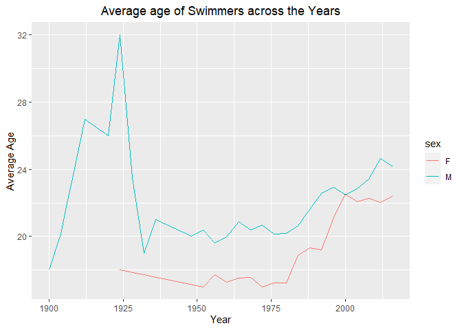

**Problem 2**  
Dataset: olympics\_top20.csv

**PART A**- So, here the 95th percentile of heights for female
competitors is 183.

**PART B**- The singles event where we can see the greatest variability
is in the event Rowing Women’s Coxed fours which has the standard
deviation on 10.9.

**PART C**

**Title** = “Average age of Swimmers across the years”  
**Caption** = We can observe from the above graph that males started
playing earlier than females.And average age for swimmers have gone up
because of that. One possible reason could be that females were not
physically fit at that time or they were involved in the world war like
situation.
