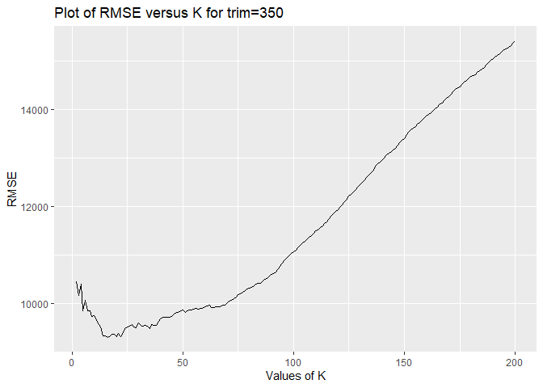
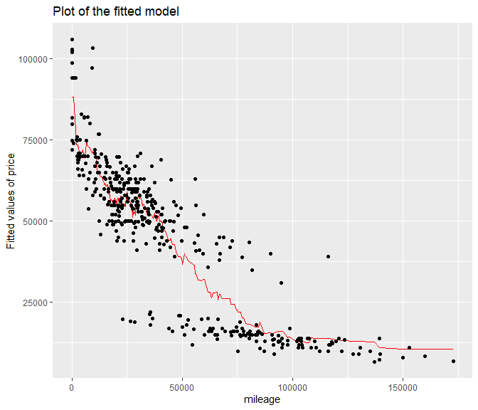
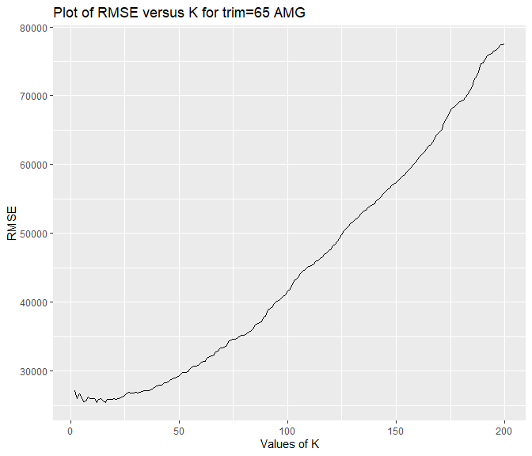
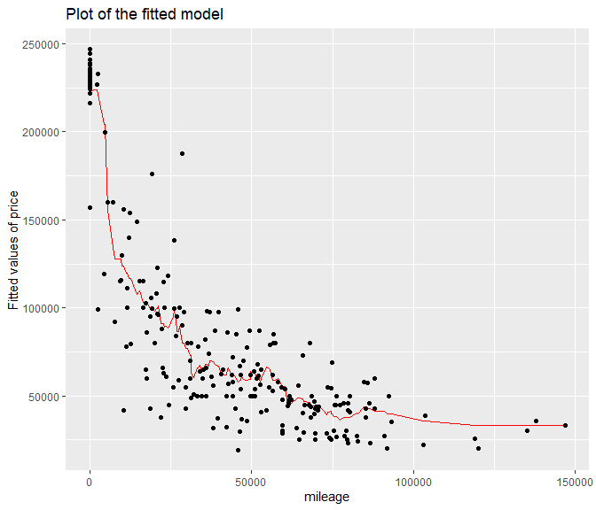

## Problem 3

We filtered the data to make two separate datasets with trim levels
equal to 350 and 65 AMG. We split each dataset into training and testing
sets, where 80% of observations are in training set. We run KNN models
for all values of K from 2 to 200, and calculated corresponding RMSE.

Figure 1. This plot shows the values of RMSE corresponding to different
values of K for the dataset with trim level = 350. The minimum value of
RMSE is reached when K is equal to 16.

Figure 2. Red line shows the fitted values of price corresponding to
different values of mileage for the optimal value of K=16 (for the
dataset with trim level = 350).

Figure 3. This plot shows the values of RMSE corresponding to different
values of K for the dataset with trim level = 65 AMG. The minimum value
of RMSE is reached when K is equal to 12.

Figure 4. Red line shows the fitted values of price corresponding to
different values of mileage for the optimal value of K=12 (for the
dataset with trim level = 65 AMG).

Taking different training and testing sets repeatedly from initial
datasets, we will get larger optimal values of K from the dataset with
trim = 350 more often than from the dataset with trim = 65 AMG.This
could happen because the observations in the dataset with trim = 65 AMG
are more scattered from each other, so we need smaller value of K to
make prediction less biased.
