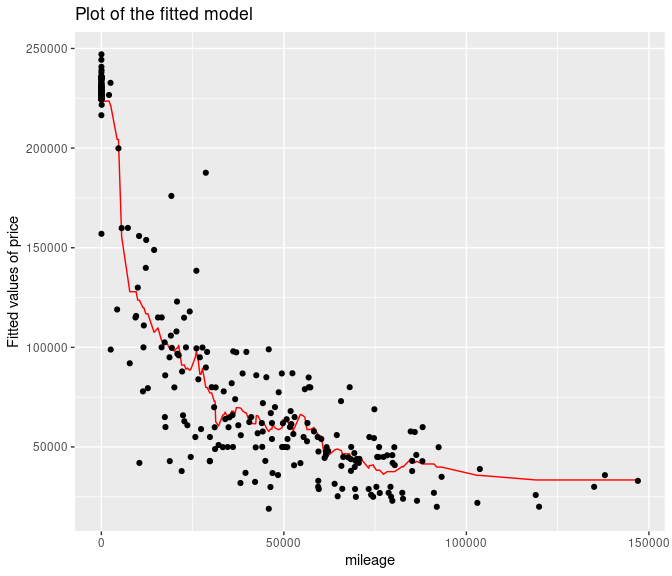

## ECO 395M: Exercises 1

## Group Members - Alina Khindanova, Anvit Sachdev, Shreya Kamble

**Problem 1**  
Dataset: ABIA.csv

The below plot shows the flight delay time (for all the airlines
combined) at different hours of the day. The delay time is calculated as
the deviation of arrival time and departure time. Mathematically, it is
written as:-  
Total Flight Delay = |Arrival Delay|+|Departure Delay|  
where |.| represents the absolute value function.  
Arrival time for all the flights is rounded off to the hour (hh) of the
day. The data is grouped by the hour (hh) of the arrival time, and the
respective mean/ average value of the Total Flight Delay is calculated
for all the hours of the day.

We can see from the above plot that the total flight delay (for all the
airlines combined) is minimum at around **8 a.m** in the morning. This
can be considered as the best time of the day to fly.

Similarly to the above plot, we now plot the total flight delay (in
minutes) v/s time of the day graph for each airline (given by the unique
carrier code).  

We can see from the above plot that the best time of day to fly to
minimize delays is different for different airlines (i.e., unique
carrier code). For instance, the best time of day to fly for the flights
with unique carrier code 9E is around 8 a.m whereas the best time of day
to fly for the flights with unique carrier code B6 is around 11 a.m.

The below plot shows the flight delay time (for all the destinations
combined) at different times of the year. The delay time is calculated
as the deviation of arrival time and departure time. Mathematically, it
is written as:-  
Total Flight Delay = |Arrival Delay|+|Departure Delay|  
where |.| represents the absolute value function.  
The data is grouped by the month of the date the flight departed, and
the respective mean/ average value of the Total Flight Delay is
calculated for all the months.  

We can see from the above plot that the average total flight delay (for
all the destinations combined) is minimum during **September** or
**October** (i.e, the 9th or the 10th month). This can be considered as
the best time of the year to fly.

Similarly to the above plot, we now plot the total flight delay (in
minutes) v/s time of the year graph for the top 10 most popular
destinations.  

We can see from the above plot that the best time of year to fly to
minimize delays is different for different destinations. For instance,
the best time of year to fly for the flights with destination code LAX
is January (i.e, the first month) whereas the best time of year to fly
for the flights with destination code ATL is September (i.e, the 9th
month).

**Problem 2**  
Dataset: olympics\_top20.csv

**PART A**- So, here the 95th percentile of heights for female
competitors is 183.

**PART B**- The singles event where we can see the greatest variability
is in the event Rowing Women’s Coxed fours which has the standard
deviation on 10.9.

**PART C**

**Caption** = We can observe from the above graph that males started
playing earlier than females. Average age for swimmers have gone up,
average age for males is relatively high as compared to females. One
possible reason could be that females were not physically fit at that
time or they were involved in the world war like situation OR we don’t
have enough data on that.

**Problem 3**  
Dataset: sclass.csv  
We filtered the data to make two separate datasets with trim levels
equal to 350 and 65 AMG. We split each dataset into training and testing
sets, where 80% of observations are in training set. We run KNN models
for all values of K from 2 to 200, and calculated corresponding RMSE.

Figure 1. This plot shows the values of RMSE corresponding to different
values of K for the dataset with trim level = 350. The minimum value of
RMSE is reached when K is equal to 16.

Figure 2. Red line shows the fitted values of price corresponding to
different values of mileage for the optimal value of K=16 (for the
dataset with trim level = 350).

Figure 3. This plot shows the values of RMSE corresponding to different
values of K for the dataset with trim level = 65 AMG. The minimum value
of RMSE is reached when K is equal to 12.

Figure 4. Red line shows the fitted values of price corresponding to
different values of mileage for the optimal value of K=12 (for the
dataset with trim level = 65 AMG).

Taking different training and testing sets repeatedly from initial
datasets, we will get larger optimal values of K from the dataset with
trim = 350 more often than from the dataset with trim = 65 AMG.This
could happen because the observations in the dataset with trim = 65 AMG
are more scattered from each other, so we need smaller value of K to
make prediction less biased.
